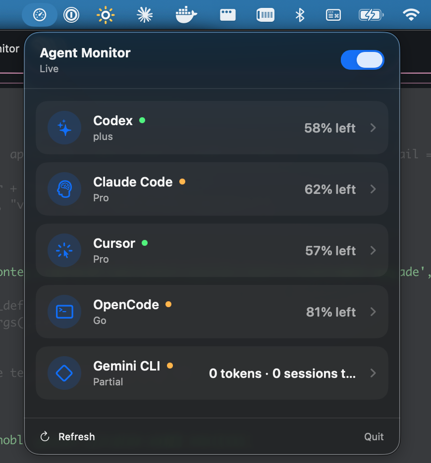
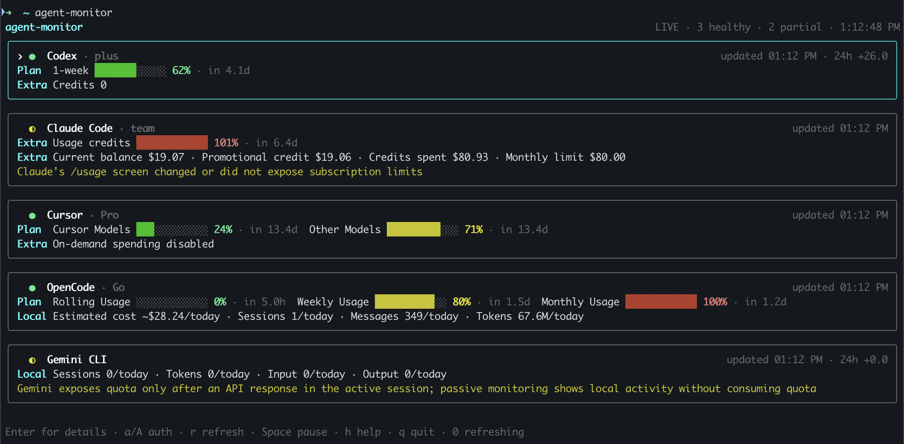

# agent-monitor

A native macOS menu-bar monitor and `htop`-style terminal dashboard for keeping
an eye on your AI coding subscriptions and local agent usage in one place.

<p align="center">
  
</p>

`agent-monitor` currently supports **Codex**, **Claude Code**, **Cursor**,
**OpenCode**, and **Gemini CLI**. It shows the information each provider
actually exposes—usage windows, reset times, credits, token counts, costs, and
local activity—without pretending that unlike metrics are directly
comparable.



The exact fields depend on the provider, account, CLI version, and whether you
have connected its optional web dashboard.

> [!IMPORTANT]
> `agent-monitor` is a local, read-only monitor. It does not send prompts,
> transcripts, credentials, or usage data to its own server.

## How it works

Each provider exposes usage differently. `agent-monitor` uses a small adapter
for each one, collects only usage-related values, normalizes them into a common
snapshot format, and renders those snapshots with
[Ink](https://github.com/vadimdemedes/ink).

```text
Provider CLIs ───────┐
Local usage files ──┼─→ provider adapters ─→ snapshots ─┬─→ terminal UI
Opt-in dashboards ──┘                                   ├─→ macOS menu bar
                                                        └─→ local history
```

| Provider | Data source | What is available |
| --- | --- | --- |
| Codex | Local Codex app-server JSON-RPC | Account windows, reset times, credits, plan, and token history |
| Claude Code | Built-in `/usage` screen; optional dashboard | Session and weekly limits; connected dashboard credits and balance |
| Cursor | `cursor-agent status/about`; optional dashboard | Authentication and plan health; connected dashboard usage |
| OpenCode | `opencode stats`; optional dashboard | Local activity and estimated cost; connected Go limits and balance |
| Gemini CLI | Local Gemini session metadata | Today's sessions and numeric token totals |

Collection runs independently for every provider. A provider failure therefore
affects only its own card. Successful values remain visible as stale data when
a later refresh fails, and repeated failures back off automatically.

Plan gauges consistently show the percentage of quota left, regardless of how
the provider reports usage. Green means ample quota remains; yellow and red
indicate that the configured usage thresholds have been reached. Additional or
overage gauges are explicitly labeled as used because they can exceed 100%.

By default, lightweight snapshots are stored in a local SQLite database so the
UI can calculate trends. Unchanged values are suppressed except for a
five-minute heartbeat, and data older than 90 days is removed automatically.
History can be disabled at any time.

## Quick start

### 1. Install the prerequisites

You will need:

- macOS
- Node.js 22.12 or newer
- [pnpm](https://pnpm.io/)
- At least one supported provider CLI, already installed and authenticated
- Google Chrome or Chromium only if you want to connect optional dashboards

You do not need every provider CLI. Missing providers simply appear as
unavailable, and you can disable them in the configuration.

### 2. Install and build

From this repository:

```sh
pnpm install
pnpm build
pnpm link --global
```

If you only want to try it from the checkout, use `pnpm dev` instead of
linking it globally.

### 3. Check which providers are ready

```sh
agent-monitor doctor
```

This checks Node.js, the configured provider executables, and their detected
versions. For machine-readable output:

```sh
agent-monitor doctor --json
```

### 4. Start the monitor

```sh
agent-monitor
```

The monitor begins collecting immediately and refreshes each provider at its
own safe interval.

### 5. Build the macOS menu-bar app

The native app requires the macOS Command Line Tools and uses the same provider
engine as the terminal dashboard:

```sh
pnpm build:macos
open "build/Agent Monitor.app"
```

The local build runs directly from this checkout. If you move the app into
`/Applications`, first make the CLI globally available with `pnpm link --global`.
The app has no Dock icon: click its gauge icon in the menu bar to see providers,
expand usage details, refresh immediately, or pause polling.

### 6. Optionally connect provider dashboards

CLI and local data work without browser access. Claude, Cursor, and OpenCode
can expose additional subscription information through their web dashboards.
Connecting one is explicit and optional:

```sh
agent-monitor auth claude
agent-monitor auth cursor
agent-monitor auth opencode
```

The command opens an isolated Chrome profile. Sign in, navigate to the
requested usage or billing page, and close Chrome. The saved profile is reused
headlessly on later runs.

You can also connect a dashboard from inside the monitor: select its provider
and press `a`.

To reuse a tab that is already signed in through your personal Chrome profile:

```sh
agent-monitor auth claude --personal
```

Personal mode requires macOS automation permission and Chrome's
**View → Developer → Allow JavaScript from Apple Events** setting. Keep the
matching usage tab open while the monitor runs. Use isolated mode if you prefer
not to grant access to your personal Chrome session.

Check the dashboard connection state with:

```sh
agent-monitor auth-status
```

## Keyboard controls

| Key | Action |
| --- | --- |
| `↑` / `↓` or `j` / `k` | Select a provider |
| `Enter` | Expand or collapse provider details |
| `a` | Connect an isolated dashboard session |
| `Shift+A` | Connect through personal Chrome |
| `r` | Refresh all providers now |
| `Space` | Pause or resume polling |
| `h` | Show help |
| `q` or `Esc` | Quit or cancel authentication |

## Useful commands

```sh
# Start with selected providers only
agent-monitor --provider codex,opencode

# Use one refresh interval for this run
agent-monitor --refresh 30

# Run without writing history
agent-monitor --no-history

# Collect once and print JSON
agent-monitor snapshot

# Collect selected providers once
agent-monitor --provider codex,opencode snapshot

# Stream live state as JSON Lines (used by the native app)
agent-monitor stream

# Use a different configuration file
agent-monitor --config ./my-config.json
```

Global options such as `--provider`, `--refresh`, and `--config` must appear
before a subcommand.

When output is redirected or the process is run without an interactive TTY,
`agent-monitor` automatically emits a single JSON snapshot instead of opening
the terminal UI.

## Configuration

Configuration is optional. The default path is:

```text
~/.config/agent-monitor/config.json
```

Example:

```json
{
  "enabledProviders": ["codex", "claude", "cursor", "opencode", "gemini"],
  "refreshSeconds": {
    "codex": 30,
    "claude": 60,
    "cursor": 300,
    "opencode": 30,
    "gemini": 60
  },
  "executables": {
    "codex": "codex",
    "claude": "claude",
    "cursor": "cursor-agent",
    "opencode": "opencode",
    "gemini": "gemini"
  },
  "warningPercent": 70,
  "criticalPercent": 90,
  "retentionDays": 90,
  "historyEnabled": true,
  "collectionTimeoutMs": 15000
}
```

Use `--config <path>` to load a different file. Executable values may also be
absolute paths when a provider CLI is not available through `PATH`.

## Local data and privacy

`agent-monitor` is designed to keep credentials and personal content out of its
own data:

- No API keys, OAuth tokens, browser cookies, email addresses, prompts,
  transcripts, or raw terminal/dashboard screens are written to configuration,
  history, logs, or snapshots.
- Codex credentials remain inside Codex; the monitor communicates with the
  already-authenticated local app-server.
- Claude terminal output and dashboard text are kept in memory only long enough
  to extract an allowlist of usage values.
- Gemini files are inspected only for session filenames and numeric `tokens`
  objects; message content is not retained.
- Dashboard parsing fails closed. An unknown page format produces partial or
  unavailable data instead of guessed values.

Local files on macOS are stored under:

```text
~/Library/Application Support/agent-monitor/
├── history.sqlite3
└── dashboard-profiles/
```

Dashboard profile directories use mode `0700`, metadata files use mode `0600`,
and Chrome manages its own cookies. Isolated browser cookies are never copied
into the monitor's configuration or history. Personal Chrome mode stores only
the selected dashboard URL and reads visible text from that matching tab.

## Limitations

- The current release targets macOS.
- Provider CLIs and web dashboards can change without notice. Parsers surface
  unsupported formats as partial or unavailable.
- Codex's local app-server protocol is experimental.
- Cursor's programmatic usage API targets teams, so personal usage requires the
  optional dashboard flow.
- Gemini cannot report passive quota state until the Gemini CLI receives an API
  response; the monitor currently focuses on local activity.

## Development

```sh
pnpm dev        # run directly from TypeScript
pnpm typecheck  # check TypeScript
pnpm test       # run the test suite
pnpm build      # compile to dist/
pnpm check      # typecheck, test, and build
```

The automated test suite uses sanitized fixtures and temporary or in-memory
SQLite databases. It does not contact provider accounts.

## License

[MIT](LICENSE)
